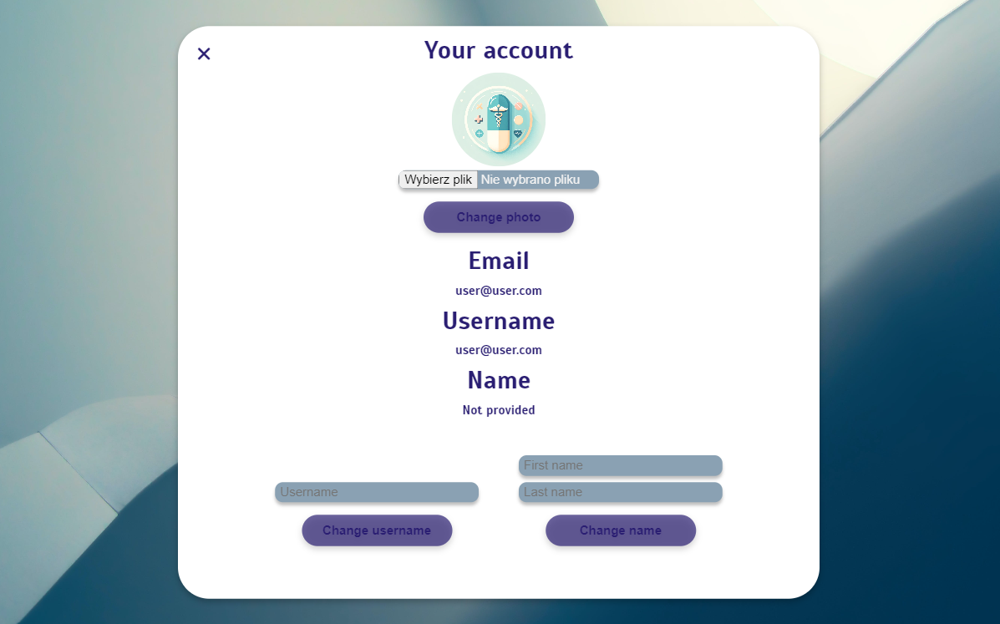
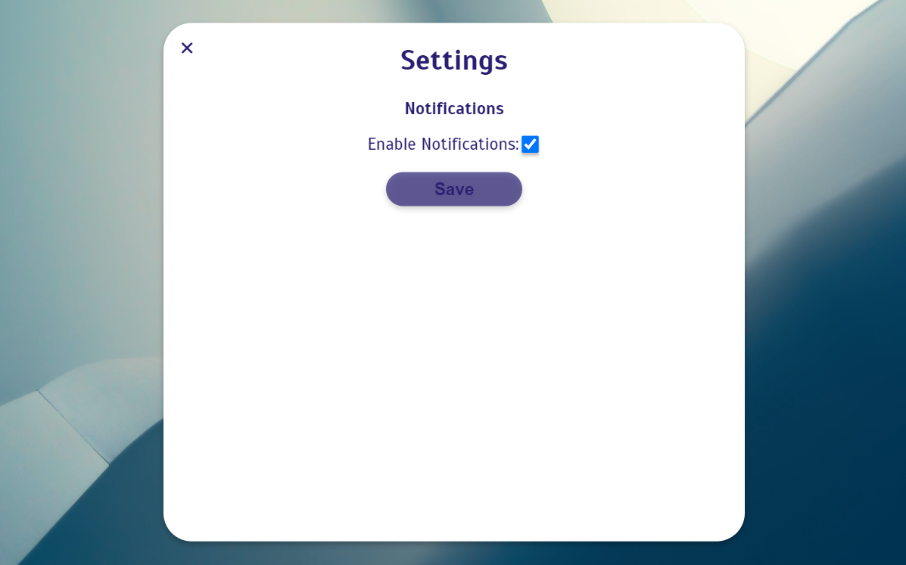
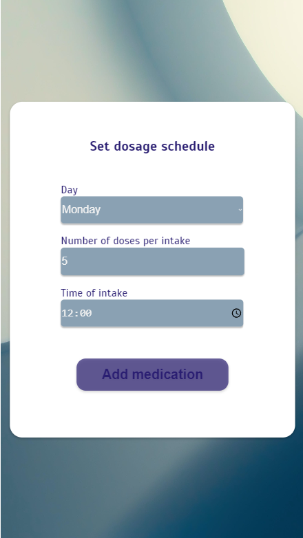

# MedMinder - Your personal Med Reminder
<div align="center">

<p>
MedMinder is an application that will ensure you never forget to take your medications again! You can create your own schedules and plan your medications for days of the week and specific hours. MedMinder will send you notifications to remind you to take your medicine.
</p>
</div>

## Key features
- <b>Creating medication schedules</b>: You can create your own medication schedule and plan your medications for days of the week and hours.
- <b>Medication database</b>: You can choose one of medications provided in database. If you can't find medication, you can add your own!
- <b>Notifications</b>: You will get notifications reminding you to take your medications

## Views
<div align="center">








</div>

## Installation
Before you begin, ensure you have [Docker](https://www.docker.com/products/docker-desktop/) installed on your system.
To run the application locally using Docker, follow these steps:

1. Clone the repository:
   ```bash
   git clone https://github.com/JanAdamowicz1/MedMinder.git
   ```
   
2. Build the Docker image:
   ```bash
   docker build -t medminder .
   ```

3. Set up docker container
    ```bash
    docker-compose up -d
   ```

## Usage

Getting started with MedMinder is easy and intuitive. Follow these simple steps to manage your medication schedule efficiently:

1. **Account Creation and Login:**
   - Sign up for a new account by providing your basic information.
   - If you already have an account, simply log in with your credentials to access your personalized dashboard.

2. **Adding Medication:**
   - Use the 'Add Medication' feature to select from a pre-populated list of common medications in our database.
   - If you have a specific medication that's not listed, you can easily add a custom entry. Just choose "Add Custom Medication" feature and provide information about your med.

3. **Scheduling Dosage:**
   - Set up a dosage schedule for each one. You can specify the day, time of day and number of doses per intake.

4. **Receiving Notifications:**
   - MedMinder ensures you never miss a dose by sending timely notifications.


## ERD Diagram


## Contributing
We welcome contributions to the MedMinder project. If you have suggestions or want to contribute, please fork the repository and submit your pull requests. For major changes, please open an issue first to discuss what you would like to change.

## License
MedMinder is released under the [MIT](https://choosealicense.com/licenses/mit/) license.

## Support and Contact
If you encounter any issues or have questions, please file an issue on the [GitHub issue tracker](https://github.com/JanAdamowicz1/MedMinder/issues).

For further assistance or feedback, reach out to us at `adm.medminder@gmail.com`.


